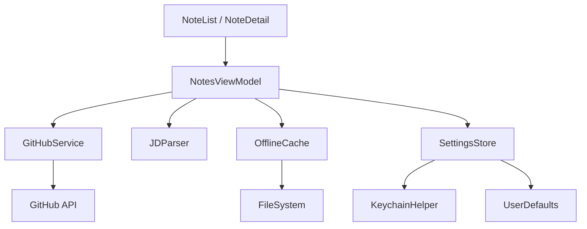

# Notes

A SwiftUI iOS app for browsing and rendering markdown notes stored in a GitHub repository. Built around the [Johnny Decimal](https://johnnydecimal.com/) organization system with support for custom prefixed indices.

## Features

- **GitHub Integration** — Fetch markdown content from any public or private GitHub repository
- **Johnny Decimal Navigation** — Browse notes using JD numbering with automatic level detection (areas, categories, items)
- **Custom System Prefixes** — Support for prefixed indices like `ITSec.S02.01` or `U03 S02.01`
- **Offline Cache** — Notes and directory listings cached locally for offline reading
- **Favorites** — Save frequently accessed folders for quick access from the root view
- **Recursive Search** — Search across all files in the repository
- **Recursive Download** — Swipe to download an entire folder tree for offline use
- **Folder Notes** — Special "readme" files matching parent folder names shown at the top
- **Secure Token Storage** — GitHub API tokens stored in iOS Keychain

## Architecture

| Module | Role |
|---|---|
| **NoteList / NoteDetail** | SwiftUI views for browsing folders and rendering markdown |
| **NotesViewModel** | `@MainActor` observable object managing state, navigation, and API calls |
| **GitHubService** | Async actor for GitHub REST API calls (contents, file fetching) |
| **JDParser** | Johnny Decimal pattern detection with support for custom prefixes |
| **OfflineCache** | Actor-based disk cache for directory listings and file content |
| **SettingsStore** | Persisted repo config (UserDefaults) and token (Keychain) |
| **KeychainHelper** | iOS Keychain wrapper for secure token storage |

## Johnny Decimal Patterns Supported

### Standard JD
- `10 Coding` — Area
- `11 iOS` — Category
- `11.01 Push Notifications.md` — Item

### Prefixed (dot separator)
- `ITSec.L Lectures` — Area
- `ITSec.L01 Cryptography` — Category
- `ITSec.L01.01 Blockchiffre.md` — Item

## Offline Behavior

| Scenario | Behavior |
|---|---|
| First launch online | Fetch from GitHub API, cache everything |
| Subsequent launch online | Show cache instantly, refresh in background |
| Offline with cache | Show cached data with "Offline" indicator |
| Offline no cache | Error message |

## License

MIT
